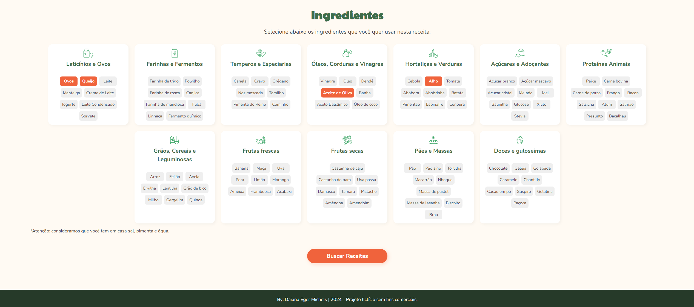

# Cookin Up
This app offers a simplified, interactive experience for culinary enthusiasts to find delicious recipes based on the ingredients available in their pantries.

## Main Features
* Ingredient Selection: Use the intuitive user interface to choose the ingredients you have. The application offers a wide variety of options to ensure complete customization according to your culinary preferences.

* Dynamic Recipe Search: After selecting the desired ingredients, simply click the "Search Recipes" button. The application will perform an intelligent filter on the extensive list of available recipes, displaying only those that can be prepared with the chosen ingredients.

## Overview





## Project Setup

```sh
npm install
```

### Compile and Hot-Reload for Development

```sh
npm run dev
```

### Type-Check, Compile and Minify for Production

```sh
npm run build
```
